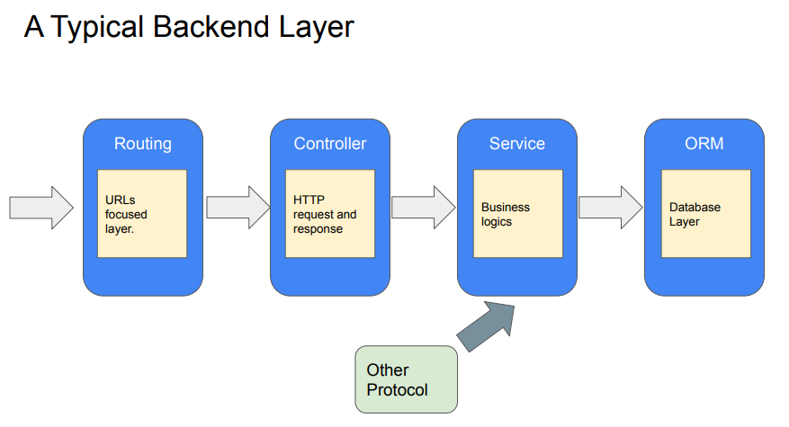
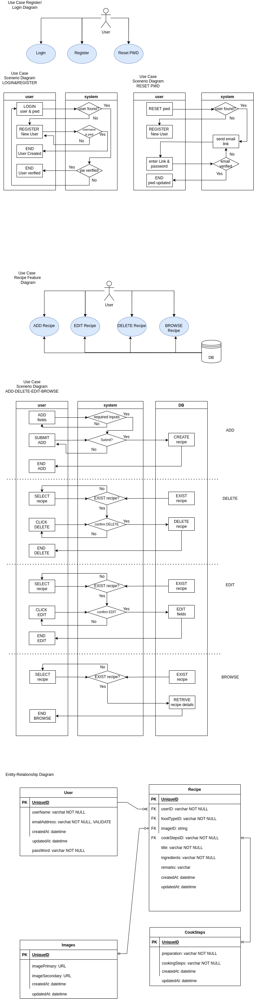
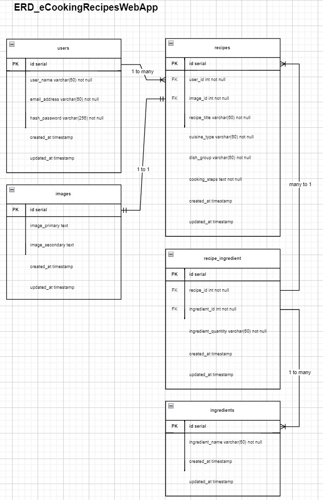

# Module 3 Project Proposal & Scopes: 

## My Cooking-Recipes Web App

A web app that allows registered user to keep their secret recipes online which allow user to key their recipes with images.
- allow user to list the 
  - ingredients, 
  - cooking methods, 
  - utensils required
  - relevant images on a persistent storage.
- user can edit/delete all their above inputs with date-stamp.
- categorization of their recipes store
  - SEAsian/Oriental/Western
  - Dish types (Starter/Main/Desert/Beverage/Bakeries).


## Type of integration required:
- React-JS frontend + node-JS backend
- Registration as verified user (name, email address and password)
- Heroku PostgreSQL (Database for users registration & login, Database for recipes storage + images)
- Server-less Deployment on Heroku




## Scopes of work:
- Software System Architecture => Leslie (Thursday 3/3) DONE
  - Use Case UML diagrams
  - Use Case Scenario UML diagrams
  - ERD digrams => Keith/Mani DONE (7/3)
- Git integration => CP, Leslie 
- MVC framework - nodeJS => Leslie 
- ReactJS UI frontend => CP 
- Authentication - Cookies/Session - passport.js & express-session: => Liew/Leslie
- ORM-Sequelize + HerokuPostgres (refer to ERD) => Mani, Keith
- Heroku Deployment.



### ERD Update by Keith



## Technologies used:
- nodeJS
- ExpressJS
  - Middleware
  - Routing
  - Cookies & Session // not use
- SequelizeJS
  - ORM
  - Queries
- Application Security (Passport, Bcrypt & JWT) - 
  - Authentication
  - Passport.js session // not use
- Model View Controller Architecture


```javascript
Project structure:
- client/
  - src 
    - index.js 
- server/
  - controllers/
    - userController.js
    - recipeController.js
  - models
    - index.js
    - ingredient.model.js
    - receipe_ingredient.model.js
    - recipe.model.js
    - user.model.js
  - routes
    - index.js
    - loginRoutes.js
  - services
    - userService.js
    - recipeService.js
  - index.js
```

## Required End-points
- User-login
```javascript
    router.route("/register") // priority Liew/Leslie
    router.route("/login") // priority Leslie
    router.route("/logout") 
    router.route("/resetpassword") 
    router.route("/deleteUser")
```
- Recipe
```javascript
    router.route("/recipe/showIngredient") // priority Mani
    router.route("/recipe/showRecipe") // priority Mani
    router.route("/recipe/add") // user.isAuthenticated() // priority CP
    router.route("/recipe/edit/:recipeId") // user.isAuthenticated() // priority CP
    router.route("/recipe/delete/:userId") // user.isAuthenticated() // priority Keith
    router.route("/search") // Charles
```

# Heroku access

Heroku postgres db setup in progress, users table done. Herewith the steps to connect to it from your local.
1. open terminal
2. heroku login
3. press any key open browser then key in credentials. Email: ch3group1@mail.com Password: ch3@group1
4. heroku pg:psql postgresql-amorphous-45283 --app ecookbook
